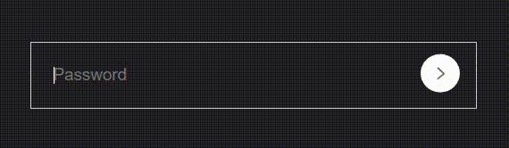

# Password Strength Meter

## Live Demo
Visit the [Live Demo](https://show-password-strength.vercel.app) to see the password strength meter in action.

## Preview

## Introduction
This repository contains a simple password strength meter implemented using HTML, CSS, and JavaScript. The meter provides visual feedback on the strength of the entered password to help users create secure passwords.

## Features
- **Password Input:** Users can enter their password in the designated input box.
- **Password Strength Indicator:** The password strength is dynamically evaluated and displayed below the input box.
- **Visual Feedback:** The input box border color and the strength indicator text color change based on the password strength.

## How to Use
1. Clone or download the repository.
2. Open the `index.html` file in a web browser.

## Password Strength Levels
- **Weak:** Less than 4 characters.
- **Medium:** Between 4 and 7 characters.
- **Strong:** 8 or more characters.

## Styles
The styling is done using the `style.css` file. Customize the appearance by modifying this file.

## Contributions
Contributions are welcome! Here's how you can contribute:

1. Fork the repository.
2. Create a new branch: `git checkout -b feature/new-feature`.
3. Make your changes and commit them: `git commit -m 'Add new feature'`.
4. Push to the branch: `git push origin feature/new-feature`.
5. Submit a pull request.

## Dependencies
No external libraries or frameworks are used. The password strength is evaluated using basic JavaScript.

## License
This project is licensed under the [MIT License](./LICENSE).

Feel free to contribute or open issues if you have any suggestions or improvements!
